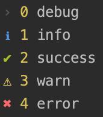

# log-util

[![NPM Version][npm-version-image]][npm-url]
[![NPM Downloads][npm-downloads-image]][npm-url]
[![MIT License][license-image]][license-url]

[![NPM][nodei-image]][nodei-url]

[![NPM][nodei-dl-image]][nodei-url]

Node.js log utility for terminal output.



## usage

`yarn add log-util`

```
var log = require('log-util');
log.debug('debug', 0);
log.info('info', 1);
log.success('success', 2);
log.warn('warn', 3);
log.error('error', 4);
```

## api

### `log.setLevel(level: string) => log`

`level` is level id or level string

### `new log.Log(0) => log`

## log levels

```
log.levels.debug === 0;
log.levels.info === 1;
log.levels.success === 2;
log.levels.warn === 3;
log.levels.error === 4;
```

[npm-version-image]: http://img.shields.io/npm/v/log-util.svg?style=flat-square
[npm-url]: https://www.npmjs.com/package/log-util
[npm-downloads-image]: http://img.shields.io/npm/dm/log-util.svg?style=flat-square
[license-image]: http://img.shields.io/badge/license-MIT-blue.svg?style=flat-square
[license-url]: LICENSE
[nodei-dl-image]: https://nodei.co/npm-dl/log-util.png?height=3
[nodei-url]: https://nodei.co/npm/log-util/
[nodei-image]: https://nodei.co/npm/log-util.svg?downloads=true&downloadRank=true&stars=true
